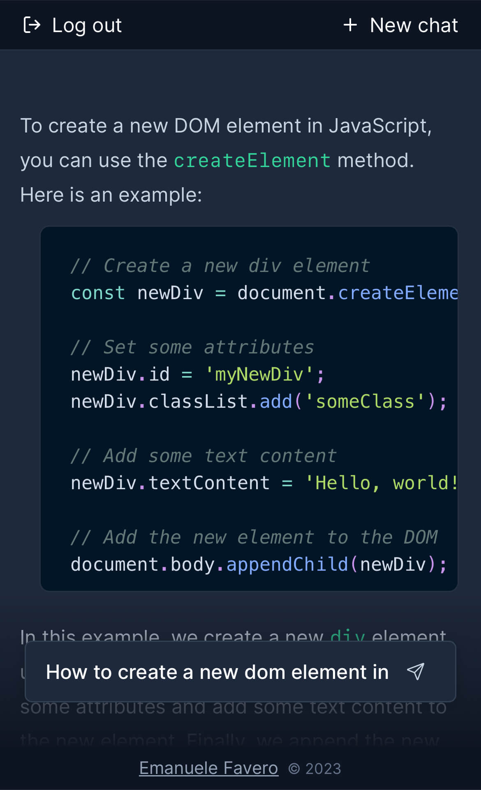

# ChatGPT Clone

This is a clone of the [ChatGPT](https://chat.openai.com/chat) website that instead uses the [GPT API](https://platform.openai.com/docs/guides/chat)

It is really useful if the free ChatGPT is down

## Demo

- [https://chatgpt-clone-ten-eta.vercel.app/chat](https://chatgpt-clone-ten-eta.vercel.app/chat)

#### Screenshot



&nbsp;

## How to use

- Clone the repo and `cd` into it
- Install the dependencies using `npm i`

- Create a `.env` file and add your OpenAI API key as well as a secret key for authentication

> Note: You can choose any secret key string you want

```bash
API_KEY=sk-xxxxxxxxxxxxxxxxxxxxxxxxxxxxxxxxxxxxxxxx
NEXT_PUBLIC_SECRET='Your secret key'
```

- Run the development server

```bash
npm run dev
```

- Open [http://localhost:3000](http://localhost:3000) with your browser to see the result.

> Note: As of early 2023 OpenAI doesn't provide the ability to store conversation memory. If you want to implement this feature, you need to use third party tools such as this one: [https://github.com/transitive-bullshit/chatgpt-api](https://github.com/transitive-bullshit/chatgpt-api)

## License

- [MIT](LICENSE.md)
